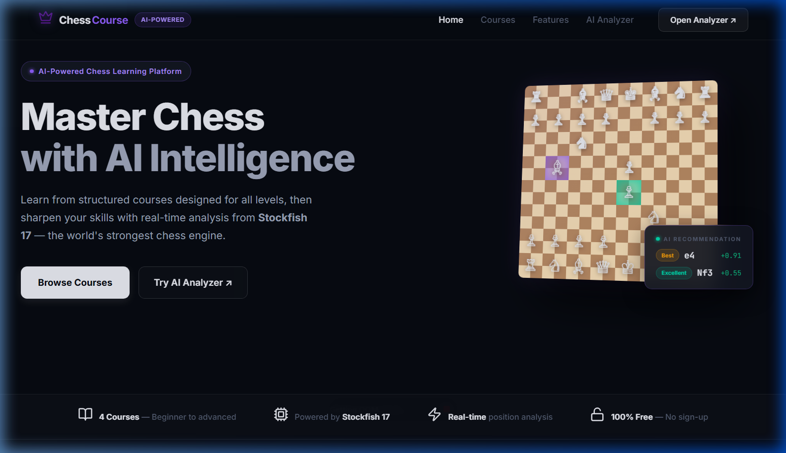

<div align="center">
  
  
  # ChessCourse

  **A complete AI-Powered Chess Learning Platform powered by Stockfish 17.**

  [](LICENSE)
  [](#)
  [](#)
  [](#)
</div>

---

## Preview

<div align="center">
  
</div>

## Features

-  **AI-Powered Analysis**: Instant best-move recommendations with multi-line analysis powered by Stockfish 17.
-  **Structured Courses**: Curated learning paths covering opening fundamentals, tactics, strategy, and endgames.
-  **Real-time Practice**: Play against the AI at adjustable Elo strengths or use the board as a free-form analyzer.
-  **Premium UI**: Clean, developer-focused dark mode design. No "AI slop" or excessive visual noise.
-  **Smart Move Classification**: Opening moves are intelligently ranked (Best, Excellent, Good) rather than relying purely on centipawn loss.
-  **SAN Conversion**: Outputs Standard Algebraic Notation (SAN) instead of raw UCI for better readability.

## Local Development

To run this project locally, you need a local server (like XAMPP or Python's `http.server`) to avoid CORS restrictions with the Web Worker that runs Stockfish.

1. **Clone the repository:**
   ```bash
   git clone https://github.com/dimasrahmandaalfarizi/chess-ai-helper.git
   ```
2. **Move to your local server directory:**
   If you use XAMPP, move the folder to `C:\xampp\htdocs\`.
3. **Open in browser:**
   Navigate to `http://localhost/chess-ai-helper/` in your web browser.

## Technologies Used

- **HTML5 & CSS3**: Custom modern dark theme.
- **Vanilla JavaScript**: Core application logic.
- **[chess.js](https://github.com/jhlywa/chess.js)**: Move generation, validation, and SAN/FEN conversion.
- **[chessboard.js](https://chessboardjs.com/)**: Board rendering and drag-and-drop interaction.
- **[Stockfish.js](https://github.com/nmrugg/stockfish.js/)**: The world's strongest chess engine compiled to WebAssembly/JS.
- **[Lucide Icons](https://lucide.dev/)**: Clean, minimal iconography.

## License

This project is open-source and available under the MIT License.
